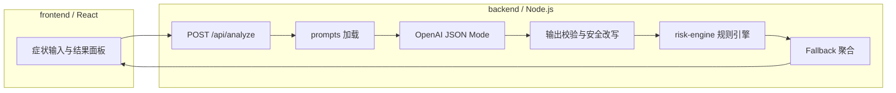

# 系统架构

## 总览

本 MVP 采用「LLM 结构化生成 + 服务端规则引擎复核 + 可解释输出 + 安全降级」的分层设计，避免单点依赖生成模型。

## 模块职责

| 模块 | 职责 |
| --- | --- |
| `frontend/` | 医疗后台风格初筛界面：大色块风险、建议动作、可折叠自然语言解释；不展示内部 JSON/规则明细。 |
| `backend/src/analyze.js` | 编排 LLM 调用、解析 JSON、合并规则结果、生成用户可读解释、触发降级。 |
| `backend/src/presenter.js` | 将内部分析结果封装为面向用户的 API 载荷（`risk` / `guidance` / `insight` / `profile`）。 |
| `prompts/` | System / Structured Output / Risk Control 分层提示词，可独立评审与版本化。 |
| `risk-engine/` | 关键词库、规则评估、科室提示、自然语言解释生成、风险等级合并（取较高）。 |

## 部署形态（本地）

- 开发：前端 `vite` 代理 `/api` → `localhost:8787`；后端单独启动。
- 一体化：构建 `frontend/dist` 后，可由 Express 静态托管（若 `dist` 存在）。

## 数据契约

对外 HTTP 响应由 `presenter` 统一封装为产品级字段（详见 [api-flow.md](./api-flow.md)）。内部仍保留完整结构化 JSON 用于编排，但不以此形态直接暴露给前端。
